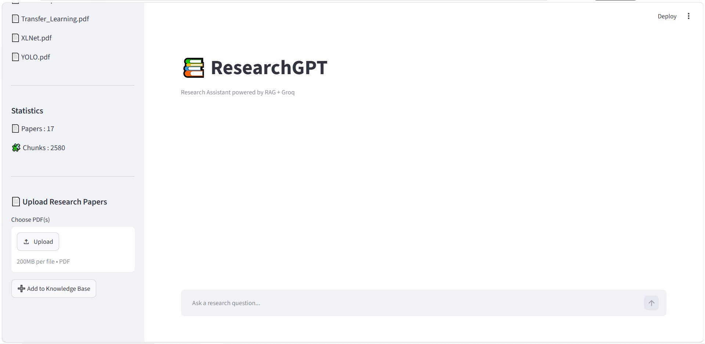
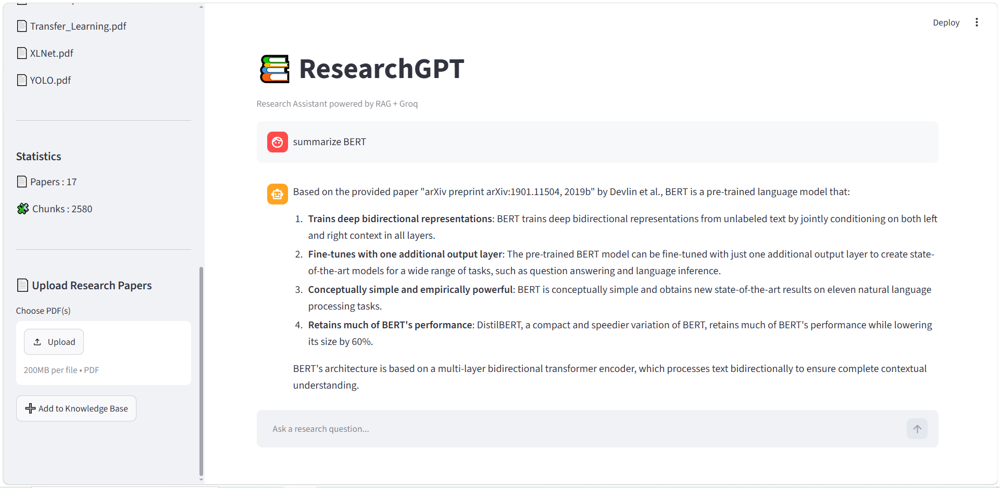
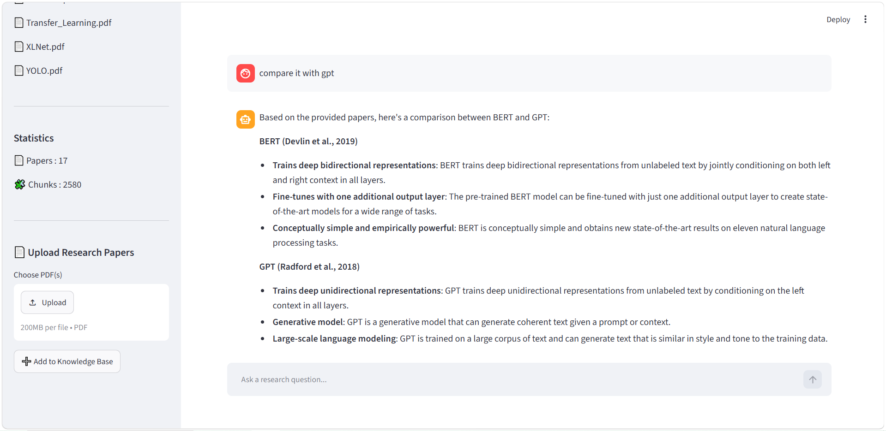

# 📚 ResearchGPT

A production-style **Retrieval-Augmented Generation (RAG)** system that answers questions directly from research papers using semantic search, cross-encoder re-ranking, conversation memory, and Large Language Models.

ResearchGPT supports **dynamic PDF uploads**, allowing users to extend the knowledge base without rebuilding the entire project.

Built with **LangChain, FAISS, HuggingFace Embeddings, Groq LLMs, Streamlit, and Docker.**

---

# Features

- 📄 Multi-PDF Research Paper Question Answering
- 📂 Dynamic PDF Upload & Knowledge Base Expansion
- 🧠 Retrieval-Augmented Generation (RAG)
- 🔍 FAISS Vector Database
- 🤗 HuggingFace Sentence Transformers Embeddings
- 💬 Conversation Memory
- 📑 Source Citations with Page References
- 🎯 MMR Retrieval
- ⚡ Cross-Encoder Re-ranking (ms-marco-MiniLM-L6-v2)
- 📊 Research Paper Comparison Mode
- 📈 Evaluation Pipeline with Semantic Similarity Scoring
- 🌐 Streamlit Web Interface
- 🐳 Dockerized Application

---

# Tech Stack

| Component | Technology |
|------------|------------|
| LLM | Groq |
| Framework | LangChain |
| Vector Database | FAISS |
| Embeddings | Sentence Transformers |
| Re-ranking | ms-marco-MiniLM-L6-v2 |
| Frontend | Streamlit |
| Evaluation | Scikit-Learn |
| Containerization | Docker |

---

# Results

### Evaluation Benchmark

- ✅ Evaluated on **50 research-focused questions**
- ✅ Achieved **78% semantic answer accuracy**
- ✅ Cross-Encoder Re-ranking improved retrieval relevance over baseline vector search
- ✅ Supports multi-document reasoning across research papers

---

# Architecture

```text
                  Research Papers
                         │
        ┌────────────────┴────────────────┐
        │                                 │
 Existing Papers                  Uploaded PDFs
        │                                 │
        └────────────────┬────────────────┘
                         │
                     PDF Loading
                         │
                      Chunking
                         │
                 HuggingFace Embeddings
                         │
                    FAISS Vector Store
                         │
                    MMR Retrieval
                         │
              Cross-Encoder Re-ranking
                         │
                     Groq LLM
                         │
         Answer + Source Citations + Memory
```

---

# Project Structure

```text
ResearchGPT/
│
├── app/
│   ├── rag/
│   │   ├── config.py
│   │   ├── embeddings.py
│   │   ├── loader.py
│   │   ├── query.py
│   │   ├── reranker.py
│   │   ├── splitter.py
│   │   ├── upload.py
│   │   ├── vectorstore.py
│   │   └── utils.py
│   │
│   └── ui/
│       ├── chat.py
│       ├── knowledge_base.py
│       ├── sidebar.py
│       ├── stats.py
│       ├── system.py
│       └── upload.py
│
├── data/
│   ├── faiss_index/
│   ├── pdfs/
│   └── uploads/
│
├── evaluation/
├── screenshots/
├── streamlit_app.py
├── create_index.py
├── main.py
├── Dockerfile
├── requirements.txt
└── README.md
```

---

# Installation

Clone the repository

```bash
git clone https://github.com/SanjaraT/ResearchGPT.git

cd ResearchGPT
```

Install dependencies

```bash
pip install -r requirements.txt
```

Create the FAISS vector database

```bash
python create_index.py
```

Launch the Streamlit application

```bash
streamlit run streamlit_app.py
```

---

# Docker

Build the Docker image

```bash
docker build -t researchgpt .
```

Run the container

```bash
docker run -p 8501:8501 --env-file .env researchgpt
```

The application will be available at:

```
http://localhost:8501
```

---

# Example Questions

```text
What is the key idea behind the Transformer model?

How does BERT differ from RoBERTa?

Compare BERT and XLNet.

What datasets were used in this paper?

What are the limitations of GAN?

Summarize the methodology of this paper.
```

---

# Screenshots

### Main Interface



### Question Answering






---

# Current Capabilities

- Ask questions across multiple research papers
- Upload new PDFs through the Streamlit interface
- Expand the knowledge base without rebuilding from scratch
- View source citations with page numbers
- Maintain conversational context
- Compare research papers
- Evaluate answer quality using semantic similarity
- Run locally or inside Docker

---

# Future Improvements

- FastAPI Backend
- CI/CD with GitHub Actions
- Cloud Deployment (Render)
- Hybrid Search (Dense + BM25)
- Authentication & User Accounts
- Persistent Chat History

---

# Author

**Sanjara**

**Interests**

- Artificial Intelligence
- Machine Learning
- Retrieval-Augmented Generation (RAG)
- Large Language Models
- NLP
- Data Science

**GitHub**

https://github.com/SanjaraT