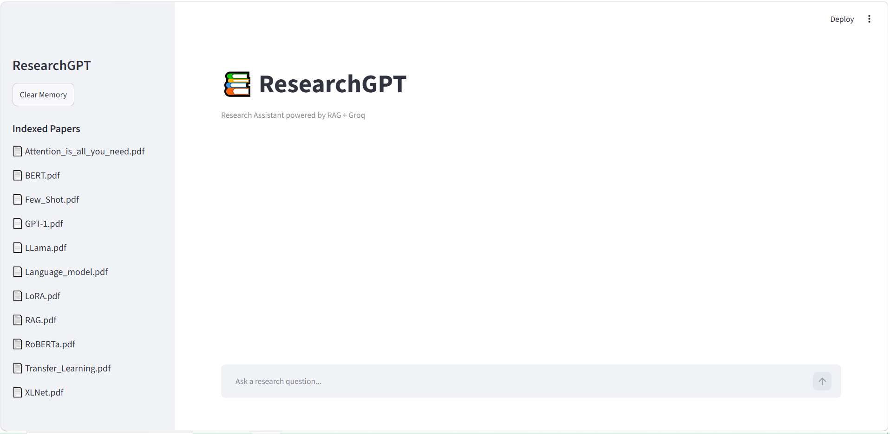
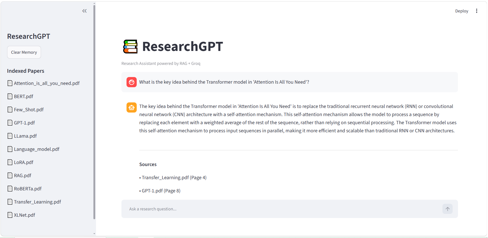
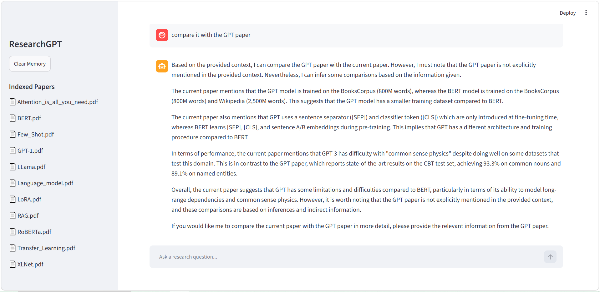

# ResearchGPT

A production-style Retrieval-Augmented Generation (RAG) system that answers questions directly from research papers using semantic search, re-ranking, conversation memory, and Large Language Models.

Built with LangChain, FAISS, HuggingFace Embeddings, Groq LLMs, and Streamlit.

---

## Features

* Multi-PDF Research Paper Question Answering
* Retrieval-Augmented Generation (RAG)
* FAISS Vector Database
* HuggingFace Embeddings
* Conversation Memory
* Source Citations with Page References
* MMR Retrieval
* Cross-Encoder Re-ranking
* Research Paper Comparison Mode
* Evaluation Pipeline
* Streamlit Web Interface

---

## Tech Stack

| Component  | Technology            |
| ---------- | --------------------- |
| LLM        | Groq                  |
| Framework  | LangChain             |
| Vector DB  | FAISS                 |
| Embeddings | Sentence Transformers |
| Re-ranking | ms-marco-MiniLM-L6-v2 |
| Frontend   | Streamlit             |
| Evaluation | Scikit-Learn          |

---

## Results

### Evaluation Benchmark

* Evaluated on **50 research-focused questions**
* Achieved **78% semantic answer accuracy**
* Cross-Encoder Re-ranking improved retrieval relevance compared to baseline vector search
* Supports multi-document reasoning across research papers

---

## Architecture

```text
PDFs
 ↓
Chunking
 ↓
Embeddings
 ↓
FAISS
 ↓
MMR Retrieval
 ↓
Cross-Encoder Re-ranking
 ↓
LLM
 ↓
Answer + Sources
```

---

## Project Structure

```text
ResearchGPT/
│
├── app/
│   └── rag/
│       ├── config.py
│       ├── embeddings.py
│       ├── loader.py
│       ├── query.py
│       ├── reranker.py
│       ├── splitter.py
│       ├── utils.py
│       └── vectorstore.py
│
├── data/
│    ├── faiss_index/ 
│    └── pdfs/
│
├── evaluation/
├── screenshots/
├── streamlit_app.py
├── create_index.py
├── main.py
├── README.md
└── requirements.txt
```

---

## Installation

```bash
git clone https://github.com/SanjaraT/ResearchGPT.git

cd ResearchGPT

pip install -r requirements.txt
```

Create the vector database:

```bash
python scripts/create_index.py
```

Launch the application:

```bash
streamlit run streamlit_app.py
```

---

## Example Questions

```text
What is the key idea behind the Transformer model in 'Attention Is All You Need'?
What improvement does RoBERTa introduce over BERT?
What is LoRA mainly used for?
What is the key innovation of BERT pretraining?
```

---

## Screenshots

### Main Interface



### Question Answering




---

## Future Improvements

* FastAPI Backend
* Docker Deployment
* CI/CD with GitHub Actions
* Hybrid Search
* PDF Upload Support

---

## Author

**Sanjara**

Interests:
Artificial Intelligence • Machine Learning • LLMs • RAG Systems • Data Science

GitHub: https://github.com/SanjaraT
